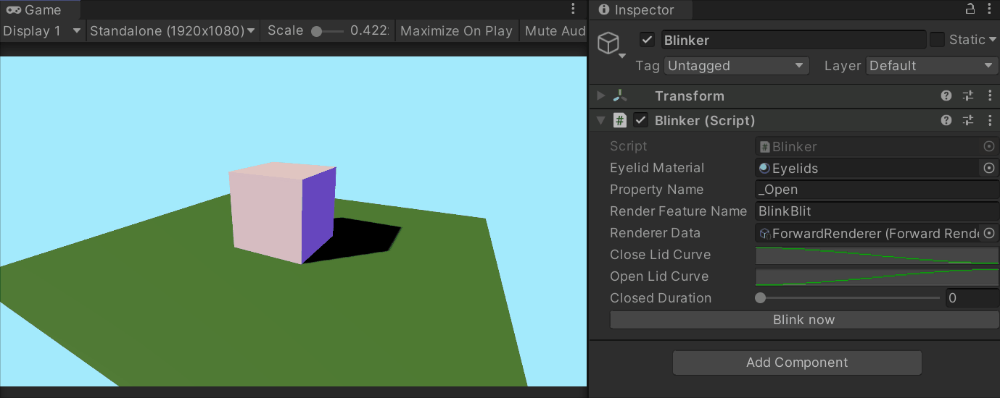
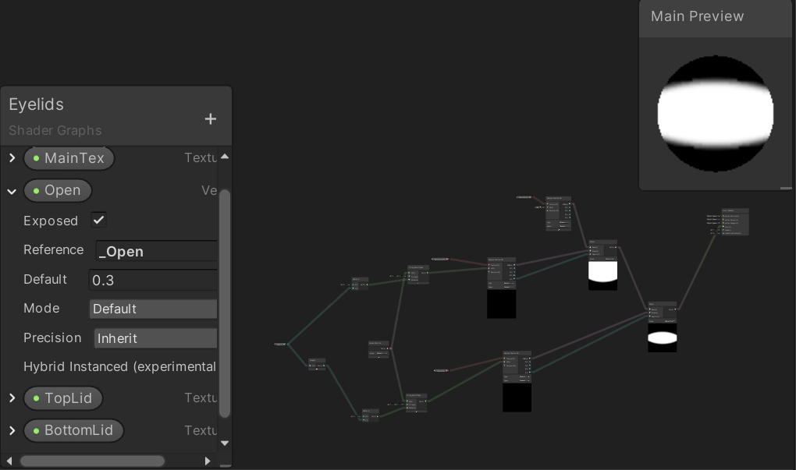
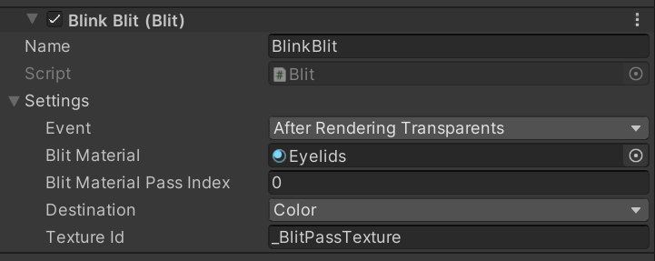

# Blink Effect for URP

Tested with Unity 2020.1.6f1

A blink effect for URP implemented with ShaderGraph and a Blit custom render feature.

## Features
* Adjustable animation timing for closing and opening, adjustable duration with eyes closed
* Public functions with callbacks for blinking, opening, closing  
* Eyelid textures included and can be exchanged for custom textures
* Compatible with URP

## Limitations
* Not tested on other versions of Unity
* Not using the latest version of the Blit render feature - see resources
* Blur is created with the texture and not adjustable programmatically

## Usage
1. Import Blink Effect folder 
2. Add a Blit RendererFeature to the ForwardRenderer
3. Add the Blinker component to an object in the scene, fill in the properties according to the description. Ensure the Render Feature Name matches the name assigned to the Blit in step 2

See Blink Effect Demo folder for example usage.

## Credit & Resources
* For compatibility with an older Unity version, this project used an older version of DrawFullScreenFeature from Unity Technologies [UniversalRenderingExamples](https://github.com/Unity-Technologies/UniversalRenderingExamples/tree/master/Assets/Scripts/Runtime/RenderPasses)
* Consulted: [Cyanilux's URP Blit Renderer Feature](https://github.com/Cyanilux/URP_BlitRenderFeature)
* Consulted: Eyeblink Effect by Simple3DAssets (Unity Asset Store link no longer working)

## License
[MIT](https://opensource.org/licenses/MIT)

- Feel free to use for your own project
- Feedback very welcome :)
